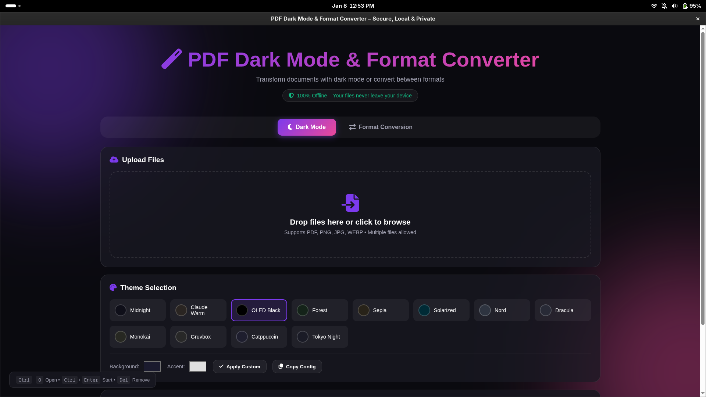

# PDF Dark Mode & Format Converter

A secure, local, and private tool to convert documents (PDF, DOCX, PPTX, Images) and apply Dark Mode to PDFs. 
**100% Offline – Your files never leave your device.**



Built by [Umais Adeed](https://github.com/Umais-Adeed).

## Features
-   **Dark Mode**: Smartly invert PDF colors while preserving images.
-   **Format Conversion**:
    -   DOCX to PDF
    -   PPTX to PDF
    -   Images to PDF
    -   PDF to Images
-   **Secure**: All processing happens locally on your machine.

## Installation

You can download the latest version from the [GitHub Releases](https://github.com/Umais-Adeed/pdf-dark-mode-file-converter/releases) page.

### Windows

1.  Download `PDF Dark Mode Setup 1.0.0.exe` from the releases page.
2.  Run the installer and follow the prompts.
3.  Launch "PDF Dark Mode" from the Start Menu or Desktop shortcut.

### Linux

#### Option 1: AppImage (Universal & Portable)
This is the easiest way to run the app on any Linux distribution (Ubuntu, Fedora, Arch, etc.).

1.  Download the `.AppImage` file (e.g., `PDF Dark Mode-1.0.0.AppImage`).
2.  Open your terminal and navigate to the download location.
3.  Make the file executable:
    ```bash
    chmod +x "PDF Dark Mode-1.0.0.AppImage"
    ```
4.  Run the app:
    ```bash
    ./"PDF Dark Mode-1.0.0.AppImage"
    ```

#### Option 2: RPM Package (Fedora, RHEL, openSUSE)
If you are using a Red Hat-based system like Fedora, you can install the RPM.

1.  Download the `.rpm` file (e.g., `pdf-dark-mode-converter-1.0.0.x86_64.rpm`).
2.  Install it using `dnf` or `rpm`:
    ```bash
    sudo dnf install ./pdf-dark-mode-converter-1.0.0.x86_64.rpm
    ```
3.  You can now launch "PDF Dark Mode" from your application menu.

## Development

If you want to build the app yourself:

1.  **Clone the repository**:
    ```bash
    git clone https://github.com/Umais-Adeed/pdf-dark-mode-file-converter.git
    cd pdf-dark-mode-file-converter
    ```

2.  **Install dependencies**:
    ```bash
    npm install
    ```

3.  **Run locally**:
    ```bash
    npm start
    ```

4.  **Build for your platform**:
    ```bash
    # For Linux
    npm run dist:linux
    
    # For Windows
    npm run dist:win
    ```
    The output files will be in the `dist/` folder.

## License

All Rights Reserved © [Umais Adeed](https://github.com/Umais-Adeed)
